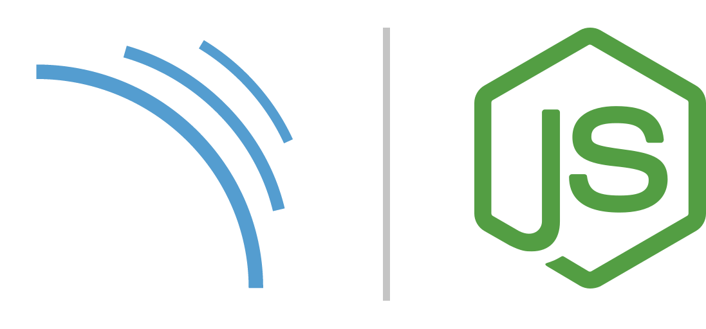

<h1 align="center">
    
</h1>

## 💻 Project summary

This project is just a study regarding the implementation of SonarQcube in a node project linking to a Docker container

## 🛠 Technologies

Project was built using **Node.js**, **Postgres**, **Docker** and the following dependencies:

- **[Babel CLI](https://www.npmjs.com/package/apollo-server-express)** - Babel command line.

- **[Babel Core](https://www.npmjs.com/package/@babel/core)** - Babel compiler core.

- **[Babel Preset ENV](https://www.npmjs.com/package/@babel/preset-env)** - A Babel preset for each environment.

- **[Babel Register](https://www.npmjs.com/package/@babel/core)** - The require hook will bind itself to node's require and automatically compile files on the fly.

- **[Babel Plugin Istanbul](https://www.npmjs.com/package/babel-plugin-istanbul/v/6.1.1)** - That instruments your code with Istanbul coverage. It can instantly be used with karma-coverage and mocha on Node.js (through nyc).

- **[Body Parser](https://www.npmjs.com/package/body-parser)** - Node.js body parsing middleware.

- **[Chai](https://www.npmjs.com/package/chai)** - Is a BDD / TDD assertion library for node and the browser that can be delightfully paired with any javascript testing framework.

- **[Cross ENV](https://www.npmjs.com/package/cross-env)** - Run scripts that set and use environment variables across platforms

- **[Eslint](https://www.npmjs.com/package/eslint)** - Is a tool for identifying and reporting on patterns found in ECMAScript/JavaScript code. In many ways, it is similar to JSLint and JSHint with a few exceptions

- **[Eslint Config Airbnb](https://www.npmjs.com/package/eslint-config-airbnb)** - This package provides Airbnb's .eslintrc as an extensible shared config.

- **[Express](https://www.npmjs.com/package/express)** - Fast, unopinionated, minimalist web framework for node.

- **[Mocha](https://www.npmjs.com/package/mocha)** - Simple, flexible, fun JavaScript test framework for Node.js & The Browser

- **[Nodemon](https://www.npmjs.com/package/nodemon)** - Is a tool that helps develop node.js based applications by automatically restarting the node application when file changes in the directory are detected.

- **[nyc](https://www.npmjs.com/package/nyc)** - Istanbul's state of the art command line interface, with support for: applications that spawn subprocesses and source mapped coverage of Babel and TypeScript projects.

-**[Supertest](https://www.npmjs.com/package/supertest)** - HTTP assertions made easy via superagent.

## 📑 How to use

To start the project, just run this command:

```
docker-compose up
```

After starting the services, just enter this address:

```
http://localhost:9000/about
```

To start a new project it is necessary to login. For this enter the following login and password.

```
Login: admin
Password: admin
```

After creating the provide token and the project key, install the SonarQube Scanner and execute the command that SonarQube will pass during the project insertion process. After this process, just run this command to generate the coverage report:

```
npm run cover
```

To bring down all the services raised, just type the following command:

```
docker-compose down
```

To stop all Docker containers (if you run this command more than once it will return an error message about parameters)

```
docker stop $(docker ps -a -q)
```

Deleting all Docker containers (Make sure you stop all containers before running this command, otherwise it will return an error.)

```
docker rm $(docker ps -a -q)
```

And finally to remove all the images you have

```
docker rmi $(docker images -q)
```

## 📖 License

This project is under license from MIT. See the [LICENSE](LICENSE.md) file for more details.
